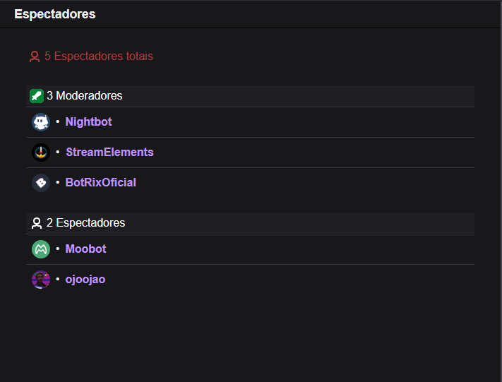

# 🎮 View Viewers

## 📌 Sobre o projeto
O **React View Viewers** é a segunda versão da aplicação web que consome a **API da Twitch** para exibir informações visualizações em live.  
O projeto foi desenvolvido como forma de **praticar o uso de React e consumo de APIs** a principio configurado apenas para a minha conta da Twitch.

🔹 Este projeto passou por **3 versões de evolução**:
1. **JavaScript Vanilla** – contato com consumo da API e estilização da interface. [Acesse o repositório clicando aqui](https://github.com/jlucassaldanha/js-view-viewers)  
2. **React (JavaScript)** – reestruturação para componentização e melhor escalabilidade. [Acesse o repositório clicando aqui](https://github.com/jlucassaldanha/react-view-viewers)
3. **React + TypeScript (deploy na Vercel)** – versão mais atual, com tipagem, organização de pastas, melhorias de performance e funcionalidades reformuladas. [Acesse o repositório clicando aqui](https://github.com/jlucassaldanha/view-viewers) 

## 🛠 Tecnologias Utilizadas
- **Front-end:** React, JavaScript, Vite 
- **Roteamento:** react-router-dom
- **Consumo de API:** Axios

## 🎯 Funcionalidades
- Exibção de visualizações de canal da Twitch em tempo real

## 🖼️ Preview

## 🔧 Como rodar localmente
Essa versão não é realmente funcional para qualquer usuário, devido ao desenvolvimento focado apenas em minha própria conta da Twitch. 
Com mudanças no código é possível utilizar para outras contas da Twitch, porém é mais recomendavel a utilização da aplicação que pode atender nativamente a outros usuários.

### 🗃️ Repositório
[👉 Acesse o repositório aqui](https://github.com/jlucassaldanha/view-viewers)

### 🌍 Deploy
[👉 Acesse o projeto online](https://view-viewers.vercel.app)

## 📫 Contato
- [GitHub: jlucassaldanha](https://github.com/jlucassaldanha)
- [LinkedIn: João Lucas Saldanha](https://www.linkedin.com/in/joao-lucas-saldanha/)
